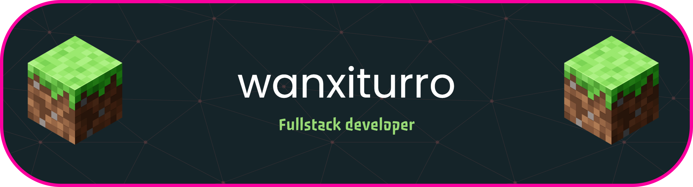

# Hey, I'm wanxiturro 
Computer Engineer with **4+ years of technical experience** in the full software development lifecycle and infrastructure management. I specialize in the **JavaScript ecosystem** (Next.js, Node.js) and **mobile development with Flutter**, building robust and scalable applications.

## My skills

---
## 🚀 About Me

What sets me apart is my **360° approach**: backed by certifications in **CCNA (Networking)** and **Cybersecurity Auditing**, I don't just build functional solutions—I architect them with **security** and **network optimization** at their core.

### 💡 What I'm Looking For:
- Applying my expertise in **software architecture** and **cybersecurity**
- Continuing to grow as a **Full Stack** and **Mobile Developer**
- Collaborating on challenging projects where I can bring a comprehensive perspective

---

## 🛠️ Tech Stack & Tools

| Category | Technologies |
|----------|--------------|
| **Frontend** | Next.js, React.js, HTML5, CSS3, Tailwind CSS |
| **Backend** | Node.js, Express.js, REST APIs, GraphQL |
| **Mobile** | Flutter, Dart, iOS & Android Development |
| **Databases** | MongoDB, PostgreSQL, Firebase, MySQL |
| **Networking** | CCNA (Routing & Switching), Wireshark, TCP/IP, VLANs |
| **Cybersecurity** | Security Auditing, OWASP Top 10, Risk Assessment, Basic Pentesting |
| **DevOps & Tools** | Git, GitHub, Docker, Linux, Postman, VS Code |

---

## 🎓 Certifications  
  
  

- **CCNA (Cisco Certified Network Associate)** - Advanced networking, routing, and switching
- **Cybersecurity Auditing** - Risk assessment, security controls, and compliance frameworks
---
## 📊 GitHub Analytics

---

## 🏆 Featured Projects

### [Project Name 1] - [Technologies Used]
Brief description of the project, highlighting your role and key achievements. What problem does it solve?

### [Project Name 2] - [Technologies Used]
Brief description of the project, focusing on technical challenges you overcame and results.

### [Project Name 3] - [Technologies Used]
Brief description of the project, emphasizing security features or network optimizations you implemented.

---

## 📫 Let's Connect

Interested in collaborating or have a project in mind? I'm open to new opportunities and challenges!

- 📧 **Email**: [your.email@example.com](mailto:your.email@example.com)
- 💼 **LinkedIn**: [linkedin.com/in/yourprofile](https://linkedin.com/in/yourprofile)
- 🐦 **Twitter**: [@yourusername](https://twitter.com/yourusername)
- 🌐 **Portfolio**: [yourportfolio.dev](https://yourportfolio.dev)

  
  
  
  

